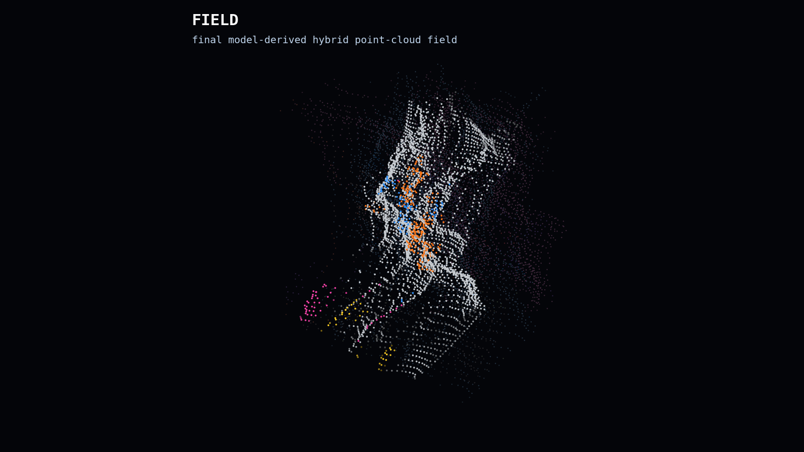
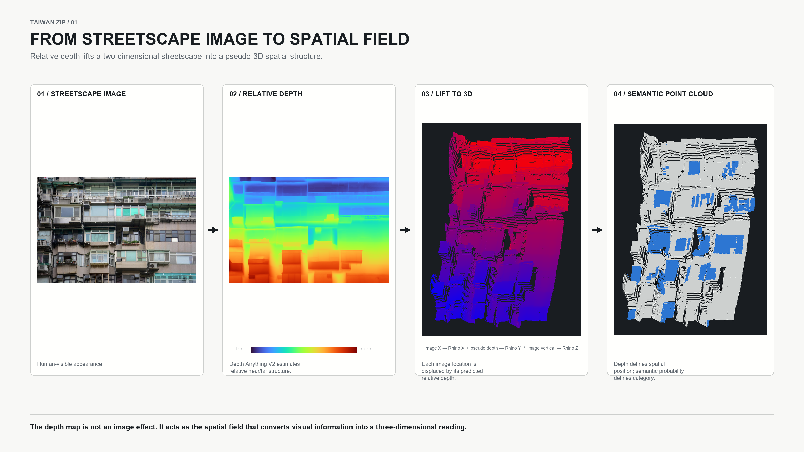
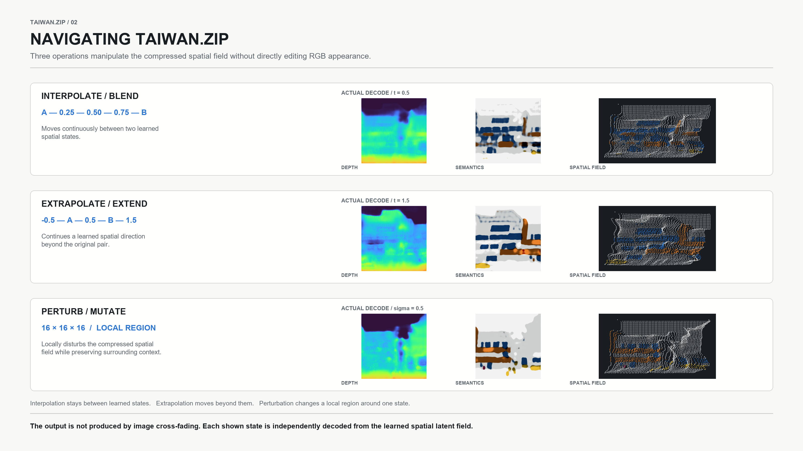
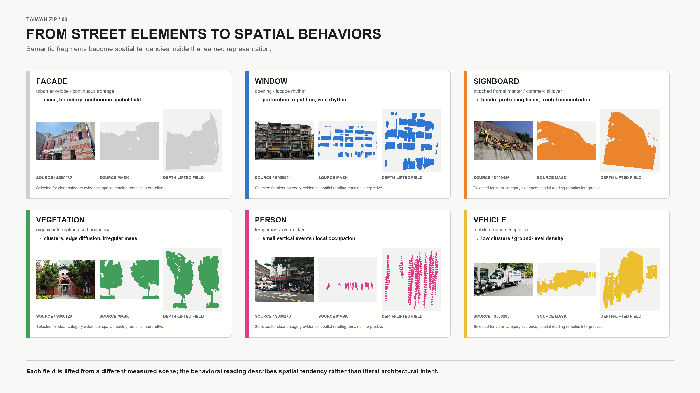
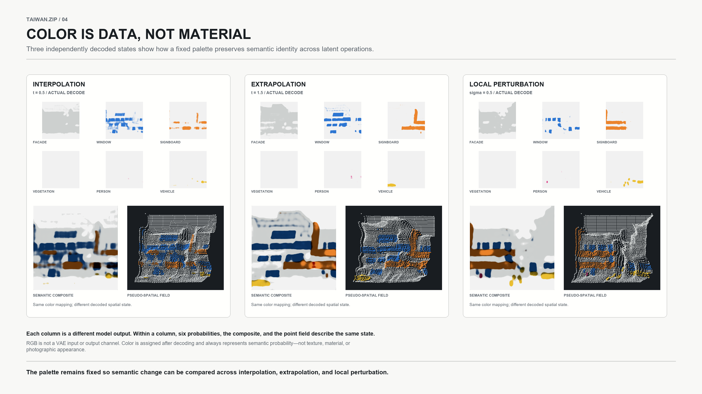
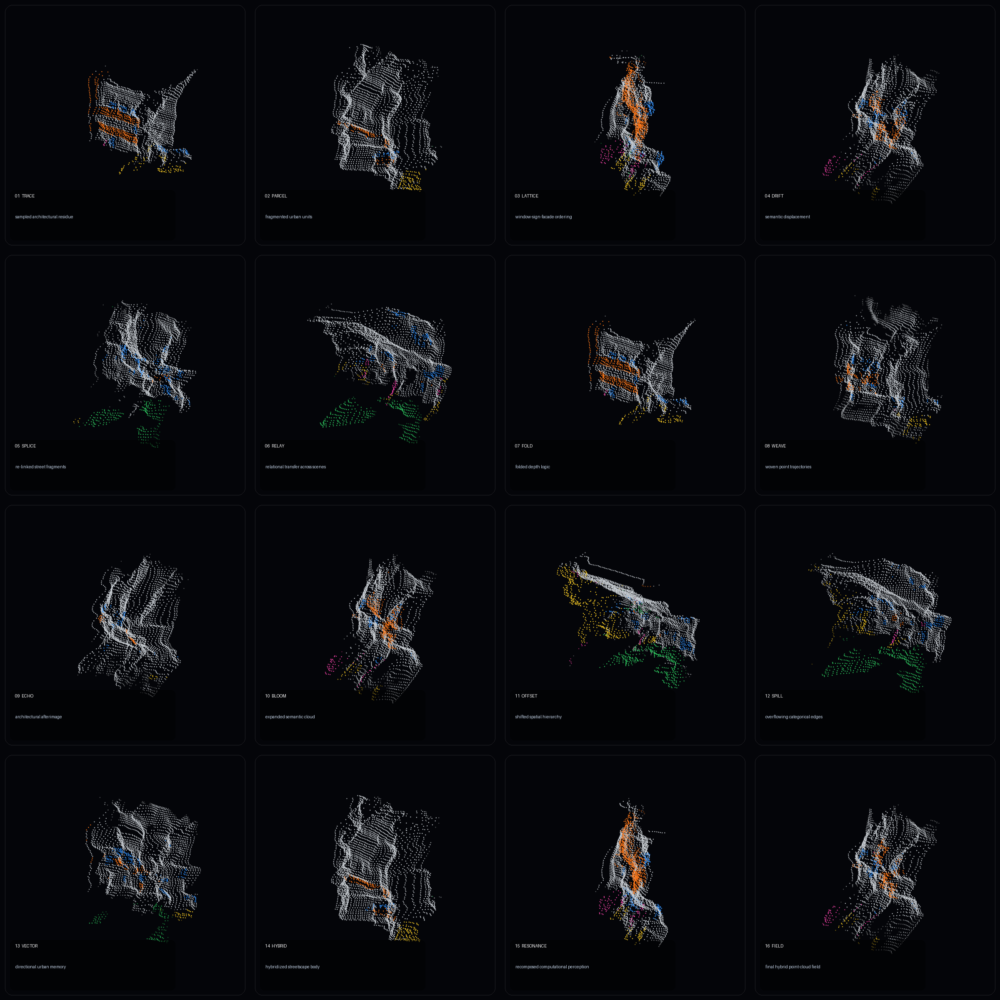

# Taiwan.zip

<p align="center">
  
</p>

<p align="center">
  <em>Taiwanese streetscape → machine perception → latent spatial transformation → reconstructed point-cloud field</em>
</p>

Taiwan.zip is an architectural research workflow that transforms Taiwanese streetscape photographs into relative depth, multi-label semantic fields, pseudo-3D point clouds, and learned spatial latent states.

The project does not ask AI to directly generate architecture as a finished image. Machine perception, abstraction, misreading, spatial reconstruction, and latent recombination become design operations.

## Visual workflow

<p align="center">
  
</p>

```text
Observed Taiwanese street
→ estimated relative depth
→ multi-label semantic decomposition
→ depth-lifted spatial field
→ Spatial VAE V2
→ latent transformation
→ point cloud / Rhino–Grasshopper workflow
```

The input remains pixel-aligned through depth and semantic processing. Point clouds are derived spatial representations rather than the primary training format.

## Playing the latent model

<p align="center">
  
</p>

The learned spatial field can be navigated through three related operations:

| Operation | Spatial reading |
|---|---|
| **Interpolation** | Moves between two learned streetscape states |
| **Extrapolation** | Extends a learned direction beyond its source pair |
| **Local perturbation** | Mutates one latent region while retaining surrounding context |

These are latent-space operations. They are not RGB cross-fades between photographs.

## Semantic spatial representation

<table>
  <tr>
    <td width="50%"></td>
    <td width="50%"></td>
  </tr>
  <tr>
    <td><strong>Street elements → spatial tendencies</strong><br>Different local scenes clarify how facade, window, signboard, vegetation, person, and vehicle fields contribute distinct spatial behaviors.</td>
    <td><strong>Color = semantic data</strong><br>A fixed palette makes probability fields and model states comparable without implying generated texture or material.</td>
  </tr>
</table>

The six semantic layers remain independent because Taiwanese streetscape elements frequently overlap—for example, windows with grilles, facades with signs, or balconies with railings.

| Channel | Meaning in the spatial representation |
|---|---|
| Facade | envelope, mass, boundary, continuous frontage |
| Window | opening, repetition, perforation, facade rhythm |
| Signboard | attached frontal marker and commercial layer |
| Vegetation | organic interruption, clusters, soft boundaries |
| Person | temporary occupation and human scale |
| Vehicle | mobile ground occupation and street-level density |

## Sixteen-state latent journey

<p align="center">
  
</p>

The state sequence records a continuous spatial journey rather than sixteen disconnected image effects. Model-derived depth and semantic fields are decoded into point-cloud configurations using a consistent camera and semantic color system.

## Repository structure

| Path | Role |
|---|---|
| `scripts/depth/` | Depth Anything V2 preprocessing and image-to-point-cloud tools |
| `scripts/parsing/` | frozen multi-label Taiwan streetscape parser |
| `scripts/corpus/` | corpus discovery, review, manifest, bulk processing, and QA |
| `scripts/dataset/` | seven-channel Spatial V2 dataset builder and validator |
| `scripts/training/` | final spatial-latent VAE V2 trainer |
| `scripts/render/` | checkpoint-driven latent morph and presentation renderers |
| `scripts/export/` | generated semantic/depth fields to PLY/XYZ |
| `scripts/legacy/` | preserved earlier global-latent and bundle-fallback programs |
| `notebooks/` | Colab presentation/training notebook |
| `configs/` | channel policy and dataset schema/summary |
| `media/` | project-generated representative media and diagrams |
| `metadata/` | compact recorded run metadata |
| `docs/` | technical context and phase reports |
| `inventories/` | source selection and exclusion provenance |

## Final model entry points

Training:

```bash
python scripts/training/taiwan_zip_spatial_vae_v2.py --help
```

Checkpoint-driven final journey renderer:

```bash
python scripts/render/render_taiwan_zip_v6_3_model_fix.py --help
```

Compact latent morph renderer:

```bash
python scripts/render/render_taiwan_zip_morph.py --help
```

Generated-state PLY export:

```bash
python scripts/export/taiwan_zip_generated_to_ply.py --help
```

## Data and checkpoints

This GitHub folder is intentionally source-first. It does not include the 604-scene image dataset, generated NPZ arrays, point-cloud exports, downloaded foundation-model weights, or the trained Spatial VAE checkpoint.

Expected external artifacts include:

- `taiwan_zip_spatial_v2_bundle.zip`
- `taiwan_zip_spatial_v2_best.pt`
- Depth Anything V2 checkpoint
- local `dataset/scenes/` when running the complete pipeline

Keep large artifacts in release storage, cloud drive, or another dataset/model registry rather than Git history.

## Technical conventions

- Training channels: `depth_norm`, `facade`, `window`, `signboard`, `vegetation`, `person`, `vehicle`
- Relative depth: `0 = farther`, `1 = nearer`; it is not metric depth
- Semantics are independent multi-label fields
- Rhino convention: `+X = image right`, `+Y = forward/depth`, `+Z = up`

## Image provenance

Every image embedded in this README is an existing Taiwan.zip project output. The README uses the project’s recorded hero image, 16-state grid, and four diagrams rendered from local RGB, relative-depth, semantic-mask, generated-field, and point-cloud data. No new illustrative or externally sourced image was generated for this README.

See [`docs/PLAYING_MODELS_CONTEXT.md`](docs/PLAYING_MODELS_CONTEXT.md) and [`GITHUB_INTEGRATION_REPORT.md`](GITHUB_INTEGRATION_REPORT.md) before reproducing the complete workflow.
